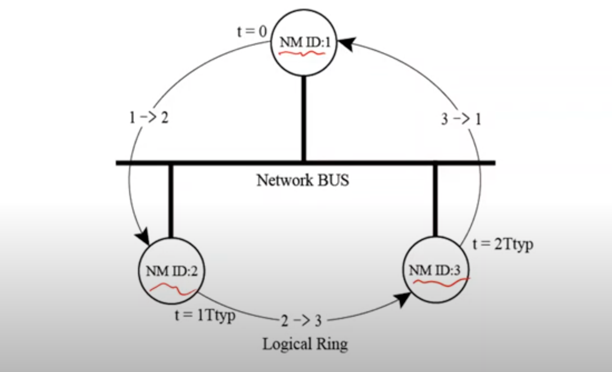
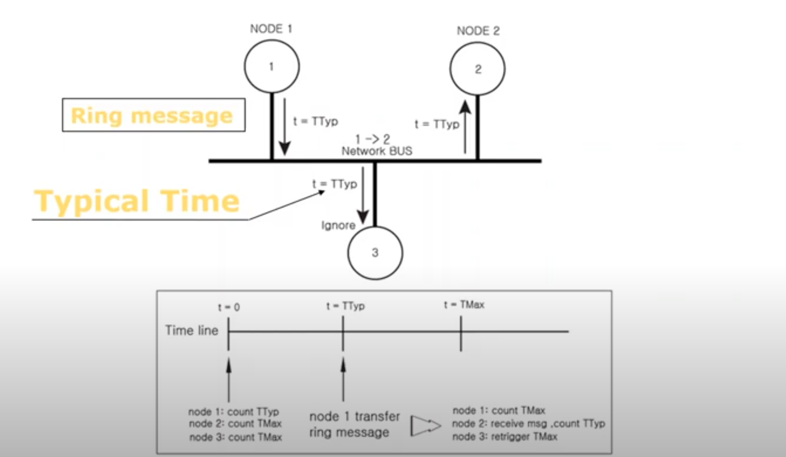
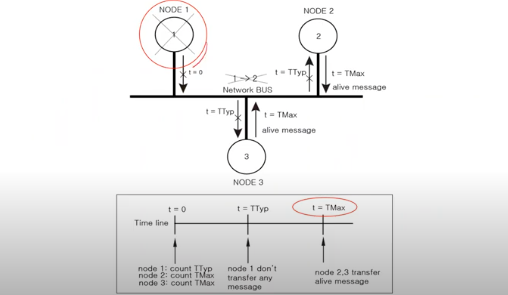
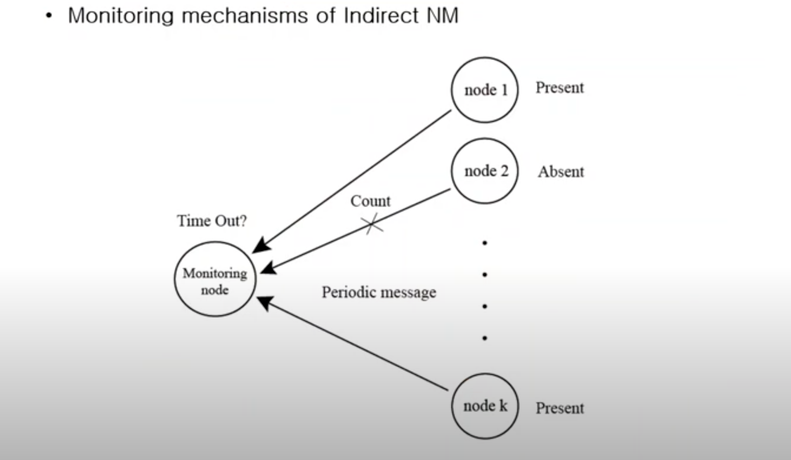
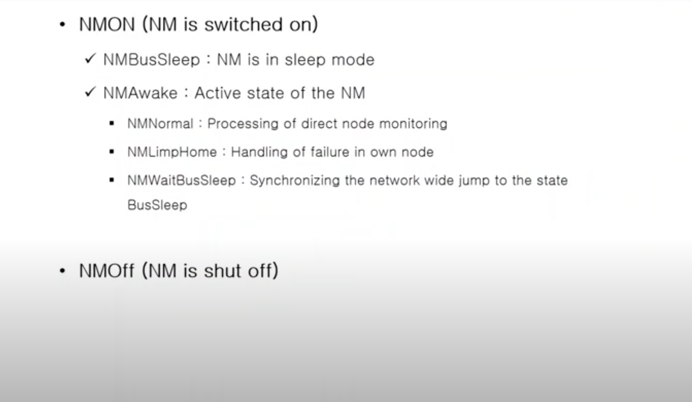
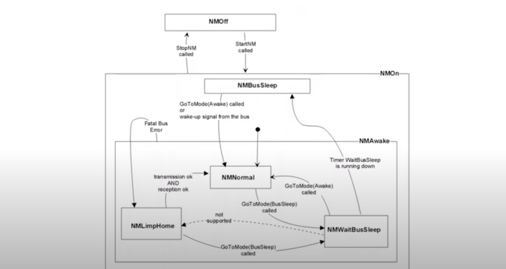

## NM parameters

|NM Parameter|Definition|Vaild Area|
|------------|----------|----------|
|NodeId|Relatvie identification of the node-specific NM Messages|local for each node specific|
|TTyp|Typical time interval between two ring messages (링 메시지간 인터벌 타임이라고 생각하면 됨)|global for all nodes|
|TMax|Maximum time interval between two ring messages (두 링 메시지간의 최대 시간 인터벌, 그러니까 타임아웃 시간이라고 생각하면 됨)|global for all nodes|
|TError|Time interval between two ring messages with NMLimpHome identification (림프홈 - 특정 노드가 Absent상태에서 Present 상태가 될때 - 상태를 구분하기위한 두 링 메시지간 타임 인터벌)|global for all nodes|
|TWaitBusSleep|Time the NM waits before transmission in NMBusSleep|globa all nodes|
|TTx|Delay to repeat the transmission request of a NM Message if the request was rejected by DLL|local for each node specific|

## Direct OSEK NM

## Logic Ring

- Logic ring with ring message timing

동일 버스 안에서 Ring Message는 모든 노드에게 전달된다.

하지만 Ring Message에 목적지 NodeId가 존재하므로, 자신의 NodeId와 받은 메시지의 NodeId가 다르다면 폐기한다.

이런식으로 링간 메시지가 돌아가면서 전달된다. 그래서 각 노드에 도달 할 때 마다 시간은 1Ttyp 만큼 늘어난다.

** Ttyp 시간은 network에 부담을 주지 않는 선에서 빠르게 모든 노드의 네트워크 상태를 알 수 있도록 시간을 설정하는 것이 중요 **

- Direct NM

위에 이야기한 내용이 담겨있음.

자신이 처리할 순서가 아니면 메시지를 무시함

노드들은 TMax를 카운트하는 카운터가 존재, 자신이 처리할 순서가 아니더라도 TMax (고정된 상수 값)까지 데이터가 들어오지 않으면 특정 노드에 문제가 생겼다고 판단. 메시지를 수신하면 본인 차례가 아니더라도 카운터를 retrigger 함.

만약 Ttyp 시간이 되었는데도 노드들이 메시지를 수신 못하면, TMax 까지 기다려 본다.

TMax시간을 초과할 때 까지 메시지를 수신 못한다면, 특정 노드에 문제가 생겼다고 판단.

현재 정상인 노드는 모두 Network Bus로 alive message를 전송함 (새로운 Logic Ring을 구성하기 위해..)

## Indirect OSEK NM

** Direct NM과 차이점 **

- Direct NM은 NM Message를 활용하여 직접 네트워크 매니지먼트 수행

- Indirect NM은 Application Message를 활용하여 네트워크 매니지먼트를 수행하는 것임. 그러니까 기존에 존재하는 인터페이스로 구현하는 것

## State of a node

- Emitter States (Sender가 판단하는 자신의 상태)
    - Node is not mute
        - Specific application message transmitted
    - Node is mute
        - Speicfic application message not transmitted during a time-out

- Recevier states (Receiver가 판단하는 다른 노드의 상태)
    - Node is present
        - Specific application message received
    - Node is absent
        - Specific application message not received during a time-out

## Extended state of a node

위와 다른 점은 long time 간을 판단한다는 것. (several time-outs)

- Extended emitter States (Sender가 판단하는 자신의 상태)
    - Node is not mute statically
        - Specific application message transmitted
    - Node is mute statically
        - Speicfic application message not transmitted during a "long" time

- Extended recevier states (Receiver가 판단하는 다른 노드의 상태)
    - Node is present statically
        - Specific application message received
    - Node is absent statically
        - Specific application message not received during a "long" time

## Monitoring mechanisms

- Transmission
    - Determination of the emitter states by using transmission monitoring scheme

    - Tranmission problems are detected by checking local confimations related to transmissions of a periodic application frame chosen among those to be sent

- Reception
    - Determination of the set of receiver states by using reception monitoring scheme

    - Monitoring node checks the presence of all its source nodes by monitoring the reception of a chosen cyclic frame

- Monitoring mechanisms of Indirect NM

모니터링 하는 노드가 있다고 하면, 

모니터링 노드가 메시지를 받은 노드는 Present.

받지 못했다면 Absent 상태라고 판단.

Application Message 만으로 노드 모니터링이 가능하다.

## Time - outs

- All message are monitored by on global time-out
    - The global monitoring time-out is located inside NM and is used as a observation
    - The time-out require longest time among all the monitored application messages

- Each message is monitored by its own dedicated time-out
    - Indriect NM uses "COM Deadline Monitoring" mechanisms to monitor dedicated application messages
    - Time-outs are located at Interaction Layer level
    - NM is informed dynamically by COM a message states which are correctly tranmistted or received or time-out.

** Application message 중 interval이 긴 메시지가 있다면... Indirect NM 을 사용하기 힘들 수 있다. **

Internal NM state

NM state of Indirect NM

## Counter

Indirect NM 에서의 카운터를 의미.

- When receiver receive message, receiver decease the counter

- When receiver does not receive the message and time-out expired, receiver increase the counter

- Receiver compare the counter with a threshold value then determine the emitter state

- OSEK NM sets the threshold to a constant value.

(기존 소프트웨어 개발에서 사용하는 time-out, retry_count 등과 비슷한 개념들임.)

