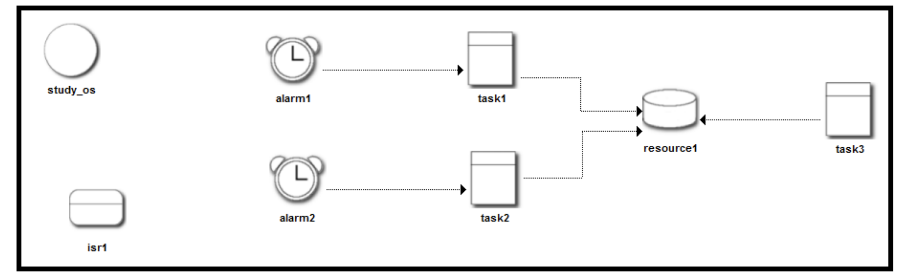

# 4월 6일 수업 내용

- Task, Interrupt, Resource, Alarm간의 관계와 우선순위에 따른 동작을 파악해보기

## 예제  설정



OS 설정 : BCC2, MIXED Sched

Task 1 :  우선순위 10, FULL pre  스케쥴링

Task 2 : 우선순위 20, Non pre  스케쥴링

Task 3 : 우선순위 30, Non pre 스케쥴링

리소스 : Ceiling prority : 256

인터럽트 : 우선순위 100

알람  1 : ALARM TIME : 100, 사이클 :  200

Alarm time 발생하는 타이밍(최초 시작될 시간)

Cycle time 이후 알람 발생할 주기

알람  2: ALARM TIME  : 110, 사이클 200

```c
#include "Qplus_Auto.h"

int i = 0;
int k = 0;

DeclareTask(task1);
```

i, k라는 플래그용 정수 선언 및 초기화
Task1 선언


**Task1**

```c
TASK(task1)
{
	k = 1;
	Uart_String(SCI_0, "\n[======Active Task 1 ===== ] \n");
	Uart_String(SCI_0, "\n[Get Resource From Task 1 ] \n");

	GetResource(resource1);
	ActivateTask(task3);

	while(k)
	{
		Uart_String(SCI_0, ".");
	}
	Uart_String(SCI_0, "\n[Release Resource from Task 1 ]\n");
	ReleaseResource(resource1);

	if (i > 5)
		ShutdownOS(E_OK);
	Uart_String(SCI_0, "\n[Terminate Task 1 ]\n");
	TerminateTask();
}
```

k = 1로 설정 후 resource1 점유를 시도한다.
이후 task3 Activate 상태로 전이시킨다. 

`while(k)` 의 경우, 인터럽트 부분에 k = 0 으로 바꾸어주는 부분이 있기 때문에 인터럽트가 발생하면 아래부분 코드가 수행될 것 (자원 반납 및 i 값 체크)

인터럽트 부분은 k = 0 및 i++ 부분이 있다.

**Task2**

```c

DeclareTask(task2);
TASK(task2)
{
	k = 1;
	Uart_String(SCI_0, "\n[======Active Task 2 ===== ] \n");
	Uart_String(SCI_0, "\n[Get Resource From Task 2 ] \n");

	GetResource(resource1);
	ActivateTask(task3);

	while(k)
	{
		Uart_String(SCI_0, ".");
	}
	Uart_String(SCI_0, "\n[Release Resource from Task 2 ]\n");
	ReleaseResource(resource1);

	if (i > 5)
		ShutdownOS(E_OK);
	Uart_String(SCI_0, '\n[Terminate Task 2 ]\n');
	TerminateTask();
}
```

Task1과 동일한 로직이다.

**Task3**

```c
DeclareTask(task3);
TASK(task3)
{
	Uart_String(SCI_0, "\n[GetResource from Task 3 ] \n");
	GetResource(resource1);
	Uart_String(SCI_0, "\n[ReleaseResource from Task 3 ] \n");
	ReleaseResource(resource1);

	Uart_String(SCI_0, "\n[Terminate Task 3 ]\n");
}
```

Task3은 단순시 자원 점유 시도 & 자원 반납을 하는 태스크다.

**Interrupt**

```c
DeclareIsr(isr1);
ISR(isr1)
{
	Uart_String(SCI_0, "\n[ISR OCCURED]\n");
	k = 0;
	i++;
	PITTF.Bits.PTF2 = 1; // clear interrupt flag
	_CLI;
}
```

k=0 및 i++ 연산을 수행, 그리고 interrupt flag를 초기화한다.


**startup hook**

```c
void StartupHook( void )
{

	Pit_Program(PIT_2, 100); // every 100ms interrupt will be executed
	Pit_Enable(PIT_2);
	Uart_String(SCI_0,"++StartupHook Start++\n");
}
```

- OS 시작시 수행할 훅, 인터럽트를 매 100ms마다 떨어지도록 `Pit_Program` 및 `Pit_Enable` 등의 작업을 수행한다.

- Pit_Program 은 주기적인 인터럽트 발생

- Pit_Enable 은 인터럽트 레지스터 활성화

## TODO

이거 돌려보면 개판짬뽕난다. 우선순위 및 타이밍이 죄다 겹쳐버려서...

다음 수업 시간때 다시 돌려보고 다시 분석해봐야함 !

## 전체 코드

**app.c**

```c
#include "Qplus_Auto.h"

int i = 0;
int k = 0;

DeclareTask(task1);
TASK(task1)
{
	k = 1;
	Uart_String(SCI_0, "\n[======Active Task 1 ===== ] \n");
	Uart_String(SCI_0, "\n[Get Resource From Task 1 ] \n");

	GetResource(resource1);
	ActivateTask(task3);

	while(k)
	{
		Uart_String(SCI_0, ".");
	}
	Uart_String(SCI_0, "\n[Release Resource from Task 1 ]\n");
	ReleaseResource(resource1);

	if (i > 5)
		ShutdownOS(E_OK);
	Uart_String(SCI_0, "\n[Terminate Task 1 ]\n");
	TerminateTask();
}

DeclareTask(task2);
TASK(task2)
{
	k = 1;
	Uart_String(SCI_0, "\n[======Active Task 2 ===== ] \n");
	Uart_String(SCI_0, "\n[Get Resource From Task 2 ] \n");

	GetResource(resource1);
	ActivateTask(task3);

	while(k)
	{
		Uart_String(SCI_0, ".");
	}
	Uart_String(SCI_0, "\n[Release Resource from Task 2 ]\n");
	ReleaseResource(resource1);

	if (i > 5)
		ShutdownOS(E_OK);
	Uart_String(SCI_0, '\n[Terminate Task 2 ]\n');
	TerminateTask();
}


DeclareTask(task3);
TASK(task3)
{
	Uart_String(SCI_0, "\n[GetResource from Task 3 ] \n");
	GetResource(resource1);
	Uart_String(SCI_0, "\n[ReleaseResource from Task 3 ] \n");
	ReleaseResource(resource1);

	Uart_String(SCI_0, "\n[Terminate Task 3 ]\n");
}

DeclareIsr(isr1);
ISR(isr1)
{
	Uart_String(SCI_0, "\n[ISR OCCURED]\n");
	k = 0;
	i++;
	PITTF.Bits.PTF2 = 1; // clear interrupt flag
	_CLI;
}
void ShutdownHook( StatusType error )
{
	Uart_String(SCI_0,"++ShutdownHook Start++\n");
}

void StartupHook( void )
{

	Pit_Program(PIT_2, 100); // every 100ms interrupt will be executed
	Pit_Enable(PIT_2);
	Uart_String(SCI_0,"++StartupHook Start++\n");
}

void PreTaskHook( void )
{
	Uart_String(SCI_0,"++PreTaskHook Start++\n");
}

void PostTaskHook( void )
{
	Uart_String(SCI_0,"++PostTaskHook Start++\n");
}
/***********************************************************************
    Task Template for Qplus-Auto.
*************************************************************************/

/***********************************************************************
    ISR Template for Qplus-Auto.
*************************************************************************/

/***********************************************************************
    ALARMCALLBACK Template for Qplus-Auto.
*************************************************************************/
```